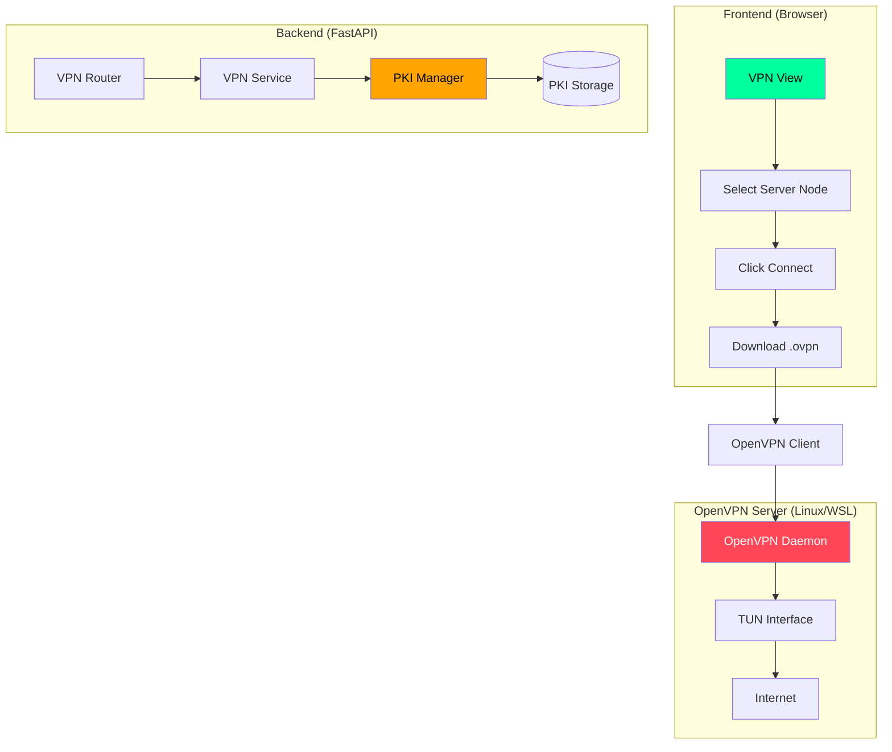
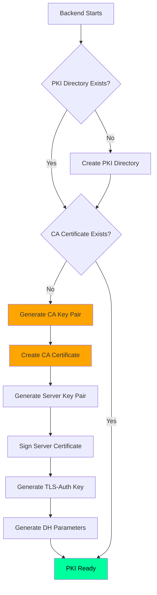
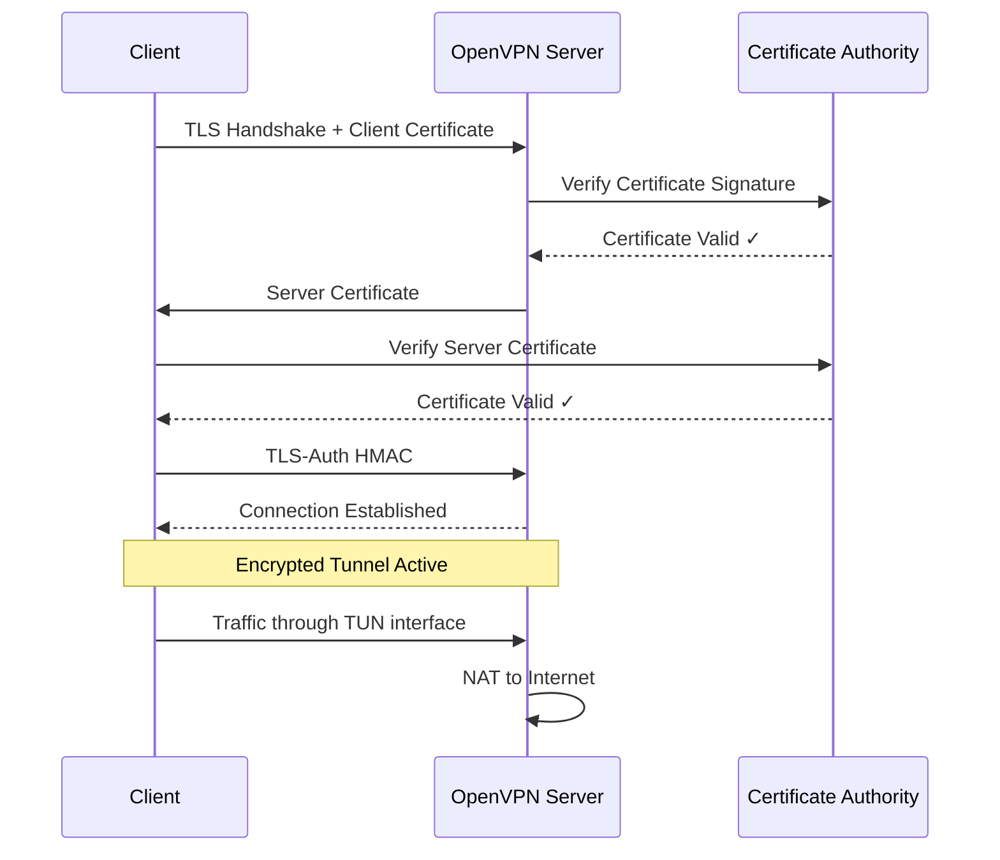
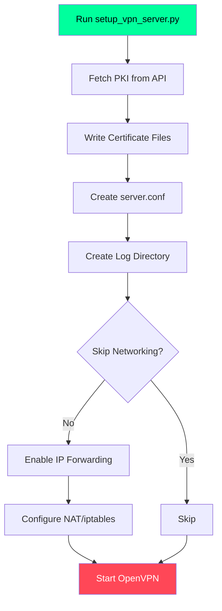

# Fsociety VPN System - Technical Documentation

## Overview

The Fsociety VPN system provides a complete OpenVPN infrastructure with:
- Real PKI (Public Key Infrastructure) for certificate management
- Automated client configuration generation
- Server setup automation
- Web-based management interface

---

## System Architecture



---

## Component Flow

### 1. PKI Initialization Flow

When the backend starts, the PKI Manager automatically initializes if certificates don't exist:



### 2. Client Configuration Generation Flow

When a user requests a VPN configuration:


### 3. VPN Connection Flow

When a client connects to the OpenVPN server:



---

## Code Architecture

### Directory Structure

```
backend/
├── utils/
│   ├── pki_manager.py      # PKI infrastructure
│   └── vpn_tools.py        # VPN config generation
├── service/
│   └── VPN_Service.py      # Business logic
├── routers/
│   └── VPN_Router.py       # API endpoints
├── model/
│   └── VPN_Model.py        # Pydantic models
└── data/
    └── pki/                # Certificate storage
        ├── ca.crt          # CA certificate
        ├── ca.key          # CA private key
        ├── server.crt      # Server certificate
        ├── server.key      # Server private key
        ├── ta.key          # TLS-Auth key
        └── dh.pem          # DH parameters
```

---

## PKI Manager (`pki_manager.py`)

The PKI Manager handles all certificate operations using Python's `cryptography` library.

### Key Generation

```python
from cryptography.hazmat.primitives.asymmetric import rsa
from cryptography.hazmat.backends import default_backend

# Generate 4096-bit RSA key for CA
ca_key = rsa.generate_private_key(
    public_exponent=65537,
    key_size=4096,
    backend=default_backend()
)

# Generate 2048-bit RSA key for clients
client_key = rsa.generate_private_key(
    public_exponent=65537,
    key_size=2048,
    backend=default_backend()
)
```

### Certificate Creation

```python
from cryptography import x509
from cryptography.x509.oid import NameOID
from datetime import datetime, timedelta

# Define certificate subject
subject = x509.Name([
    x509.NameAttribute(NameOID.COUNTRY_NAME, "IN"),
    x509.NameAttribute(NameOID.STATE_OR_PROVINCE_NAME, "Maharashtra"),
    x509.NameAttribute(NameOID.ORGANIZATION_NAME, "Fsociety Security"),
    x509.NameAttribute(NameOID.COMMON_NAME, "Fsociety Root CA"),
])

# Build certificate
cert = (
    x509.CertificateBuilder()
    .subject_name(subject)
    .issuer_name(subject)  # Self-signed for CA
    .public_key(ca_key.public_key())
    .serial_number(x509.random_serial_number())
    .not_valid_before(datetime.utcnow())
    .not_valid_after(datetime.utcnow() + timedelta(days=3650))
    .add_extension(
        x509.BasicConstraints(ca=True, path_length=None),
        critical=True
    )
    .sign(ca_key, hashes.SHA256(), default_backend())
)
```

### Client Certificate Signing

```python
def generate_client_certificate(self, client_name: str):
    """Generate and sign a client certificate."""
    
    # Load CA credentials
    ca_key, ca_cert = self._load_ca()
    
    # Generate client key
    client_key = rsa.generate_private_key(
        public_exponent=65537,
        key_size=2048,
        backend=default_backend()
    )
    
    # Build certificate signed by CA
    client_cert = (
        x509.CertificateBuilder()
        .subject_name(x509.Name([
            x509.NameAttribute(NameOID.COMMON_NAME, client_name),
        ]))
        .issuer_name(ca_cert.subject)  # Signed by CA
        .public_key(client_key.public_key())
        .serial_number(x509.random_serial_number())
        .not_valid_before(datetime.utcnow())
        .not_valid_after(datetime.utcnow() + timedelta(days=365))
        .add_extension(
            x509.ExtendedKeyUsage([ExtendedKeyUsageOID.CLIENT_AUTH]),
            critical=False
        )
        .sign(ca_key, hashes.SHA256(), default_backend())  # Sign with CA key
    )
    
    return cert_pem, key_pem
```

---

## VPN Service (`VPN_Service.py`)

The VPN Service orchestrates certificate generation and config building.

### Configuration Generation

```python
def generate_openvpn_config(self, request: VPNConfigRequest, user_id: str):
    """Generate a complete .ovpn configuration."""
    
    # Create unique client identifier
    config_id = str(uuid.uuid4())
    client_name = f"{user_id}_{server_id}_{config_id[:8]}"
    
    # Generate REAL certificates using PKI
    client_cert, client_key = pki_manager.generate_client_certificate(client_name)
    
    # Get CA certificate and TLS-Auth key
    ca_cert = pki_manager.get_ca_certificate()
    ta_key = pki_manager.get_ta_key()
    
    # Build OpenVPN config with embedded certificates
    config_content = self._build_openvpn_config(
        server_ip=self.vpn_server_ip,
        port=self.vpn_server_port,
        protocol=self.vpn_protocol,
        ca_cert=ca_cert,
        client_cert=client_cert,
        client_key=client_key,
        ta_key=ta_key
    )
    
    return config_content
```

### OpenVPN Config Template

```python
def _build_openvpn_config(self, ...):
    """Build complete .ovpn file."""
    
    config = f"""
client
dev tun
proto {protocol}
remote {server_ip} {port}
resolv-retry infinite
nobind
persist-key
persist-tun

remote-cert-tls server
cipher AES-256-GCM
auth SHA256
key-direction 1

verb 3

<ca>
{ca_cert}
</ca>

<cert>
{client_cert}
</cert>

<key>
{client_key}
</key>

<tls-auth>
{ta_key}
</tls-auth>
"""
    return config
```

---

## API Endpoints (`VPN_Router.py`)

### Available Endpoints

| Method | Endpoint | Description |
|--------|----------|-------------|
| GET | `/vpn/servers` | List available VPN nodes |
| POST | `/vpn/openvpn` | Generate OpenVPN config |
| POST | `/vpn/wireguard` | Generate WireGuard config |
| GET | `/vpn/configs` | Get user's config history |
| GET | `/vpn/server-setup` | Get PKI files for server |

### Example: Generate Config

```python
@router.post("/openvpn", response_model=VPNConfigResponse)
async def generate_openvpn_config(
    request: VPNConfigRequest,
    current_user: dict = Depends(get_current_user)
):
    """Generate an OpenVPN configuration file."""
    config = vpn_service.generate_openvpn_config(
        request, 
        current_user['id']
    )
    return config
```

---

## Frontend Integration (`vpn.js`)

### Connection Flow

```javascript
// User clicks Connect button
connectBtn.addEventListener('click', async () => {
    if (!this.selectedServer) {
        Utils.showToast('Please select a server node first', 'info');
        return;
    }

    // Show progress
    await Utils.visualizeProgress('vpn-connect', 2000, [
        'Generating Keys...',
        'Creating Certificates...',
        'Building Config...',
        'Finalizing...'
    ]);

    // Enable download
    dlAction.style.display = 'block';
});

// Download handler
async triggerDownload() {
    const response = await Api.post('/vpn/openvpn', {
        server_address: srv.address,
        port: 1194,
        protocol: 'udp'
    });

    if (response && response.config_content) {
        // Create download blob
        const blob = new Blob([response.config_content], {
            type: 'application/x-openvpn-profile'
        });
        
        // Trigger download
        const url = window.URL.createObjectURL(blob);
        const a = document.createElement('a');
        a.href = url;
        a.download = `${response.filename}.ovpn`;
        a.click();
    }
}
```

---

## Server Setup Automation

The `setup_vpn_server.py` script automates the entire server configuration:



### Usage

```bash
# Basic usage
sudo python3 setup_vpn_server.py \
    --api-url http://localhost:8000 \
    --token YOUR_JWT_TOKEN

# For WSL (skip networking)
sudo python3 setup_vpn_server.py \
    --api-url http://localhost:8000 \
    --token YOUR_JWT_TOKEN \
    --skip-networking
```

---

## Security Considerations

### Certificate Specifications

| Certificate | Key Size | Algorithm | Validity | Purpose |
|------------|----------|-----------|----------|---------|
| Root CA | 4096-bit RSA | SHA-256 | 10 years | Sign all certs |
| Server | 2048-bit RSA | SHA-256 | 5 years | Server auth |
| Client | 2048-bit RSA | SHA-256 | 1 year | Client auth |

### Security Features

1. **TLS-Auth (HMAC Firewall)**
   - 2048-bit static key
   - Prevents unauthorized connections
   - DoS protection

2. **Perfect Forward Secrecy**
   - DH key exchange
   - Session keys not derivable from master

3. **Strong Encryption**
   - AES-256-GCM cipher
   - SHA-256 HMAC

4. **Mutual Authentication**
   - Server verifies client certificate
   - Client verifies server certificate

---

## Environment Configuration

### Backend `.env`

```env
# VPN Server Configuration
VPN_SERVER_IP=106.215.155.126
VPN_SERVER_PORT=1194
VPN_PROTOCOL=udp
```

### Updating Server IP

If your IP changes:

1. Update `.env` with new IP
2. Restart the backend
3. Generate new client configs
4. Old configs will point to old IP (won't work)

---

## Troubleshooting

### Common Issues

| Issue | Cause | Solution |
|-------|-------|----------|
| `certReadError` | Invalid certificate format | Regenerate with PKI manager |
| Connection timeout | Firewall blocking | Open UDP 1194 |
| TLS handshake failed | Certificate mismatch | Use same CA for server/client |
| No internet through VPN | NAT not configured | Run `setup_networking()` |

### Debug Commands

```bash
# Check OpenVPN logs
sudo tail -f /var/log/openvpn/openvpn.log

# Verify certificate chain
openssl verify -CAfile ca.crt client.crt

# Test port
nc -zvu SERVER_IP 1194
```

---

## Future Improvements

- [ ] Certificate Revocation List (CRL)
- [ ] Multi-server geographic routing
- [ ] WireGuard with real keys
- [ ] Admin PKI management panel
- [ ] Automatic certificate renewal

---

*Last updated: 2026-01-27*
